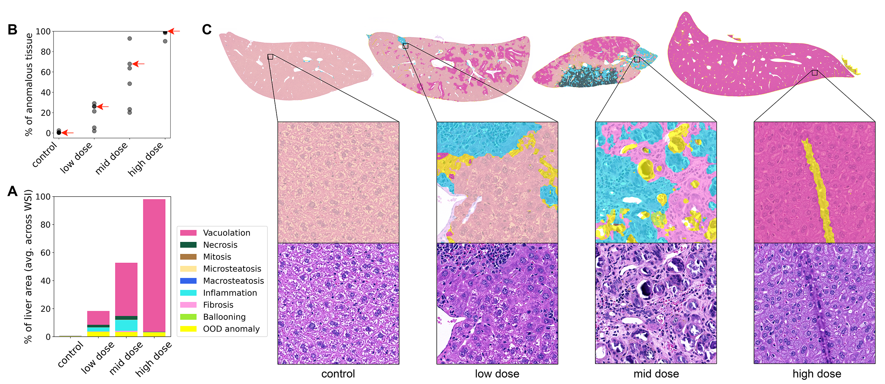
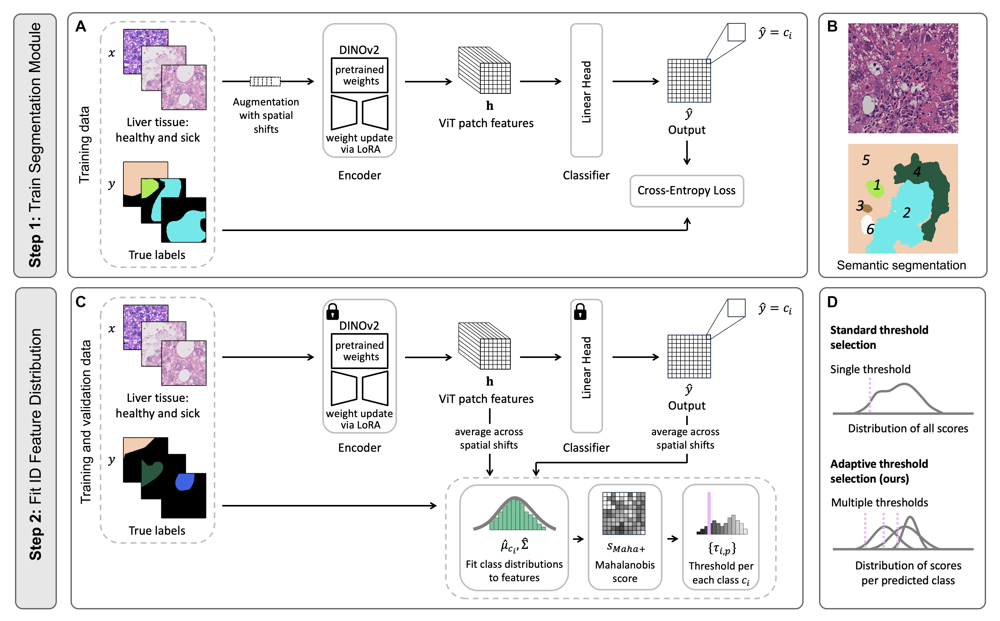
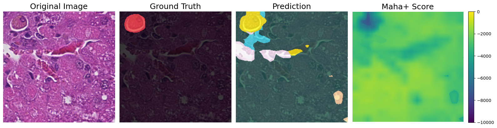

# Toxicity Assessment in Preclinical Histopathology via Class-Aware Mahalanobis Distance for Known and Novel Anomalies

-------

This repository contains a PyTorch implementation of the method introduced in *O. Graf, D. Patel, P. Groß, C. Lempp, M. Hein, F. Heinemann. "[Toxicity Assessment in Preclinical Histopathology via Class-Aware Mahalanobis Distance for Known and Novel Anomalies](https://arxiv.org/abs/2602.02124)" (preprint).*

The paper proposes an AI-based anomaly detection framework for histopathological whole-slide images (WSIs) of rodent liver tissue from toxicology studies. The system performs **pixel-wise semantic segmentation** of healthy tissue and known pathology types (in-distribution, ID), and simultaneously detects **rare, unseen pathologies** as out-of-distribution (OOD) anomalies using the Mahalanobis distance with class-adaptive thresholds.



**Figure** above shows detection of adverse drug reactions in a preclinical toxicological liver study. **A.** Percentage of liver area occupied by different anomalies (averaged across WSIs) for each dose group. Results correspond to pathological alterations confirmed by a pathologist. **B.** Each dot represents a single WSI and shows the total percentage of anomalous tissue. Four arrows correspond to the WSI examples shown in **C. C.** Examples of detected anomalies across dose groups: cytoplasmic vacuolation shows dose dependency, while other anomaly types do not.

------

## Method overview



The approach follows a two-step pipeline:

**Step 1 – Semantic segmentation.** A pre-trained [DINOv2](https://github.com/facebookresearch/dinov2) ViT-Base/14 backbone is adapted to histopathological data via Low-Rank Adaptation (LoRA), with a lightweight linear segmentation head trained on pixel-wise annotations of healthy tissue and known pathology classes.

**Step 2 – OOD anomaly detection.** The trained encoder is used to extract pixel-wise feature representations. Class-conditional Gaussian distributions (class means and a shared covariance matrix) are estimated on the training/validation set. At inference, the Mahalanobis distance to the predicted class is computed for each pixel as the anomaly score (**Maha+**). Unknown anomalies are flagged when the score falls below a **class-specific threshold**, which accounts for the strong variability of score distributions across tissue classes.

------

## Requirements

```
PyTorch, NumPy, Pillow, matplotlib, tqdm, pandas, seaborn, scikit-learn
```

The code was tested under `Python 3.11` with `PyTorch 2.0.0 (CUDA 11.7)` and the packages listed in `requirements.txt`. For a minimal set of direct dependencies see `requirements-min.txt`. The code should also run with other recent PyTorch versions.

------

## Experiments

### Setting up the dataset

The dataset consists of H&E-stained mouse liver WSIs tiled into 672×672 px images. Pixel-wise annotations are provided for 12 tissue classes. Two classes (apoptosis, artifact) are reserved exclusively for OOD evaluation.

* The dataset is available for download at https://osf.io/mkvct/.
* Organize your data into three sub-directories: `img/` (tile images), `mask/` (pixel-wise annotation masks), and `split/` (train/val/test split files).
* Set `DATASET_ROOT_DIR` and `PROJECT_ROOT_DIR` in `config.py` to point to your data directory and project root, respectively.

**Expected dataset folder structure**
```
<DATASET_ROOT_DIR>
├── img/                  # tissue tile images (.png)
├── mask/                 # pixelwise annotation masks (.png)
└── split/
    ├── train.txt
    ├── val.txt
    ├── trainval.txt
    └── test.txt
```

Each `.txt` file lists the relative file paths (without extension) of the tiles belonging to that split.

### Tissue classes

The following classes are defined in `config.py`. Classes marked as **OOD** (with `index = -1`) are excluded from segmentation training and used solely for OOD evaluation.

| Class               | Role          |
|---------------------|---------------|
| normal              | ID            |
| ballooning          | ID (anomaly)  |
| cyt_vacuolation     | ID (anomaly)  |
| fibrosis            | ID (anomaly)  |
| inflammation        | ID (anomaly)  |
| macrosteatosis      | ID (anomaly)  |
| microsteatosis      | ID (anomaly)  |
| mitosis             | ID (anomaly)  |
| necrosis            | ID (anomaly)  |
| no_tissue           | ID            |
| apoptosis           | **OOD**       |
| artifact            | **OOD**       |

### Configuration

All hyperparameters, paths, and class definitions are controlled via `config.py`. Key settings:

| Parameter          | Default                        | Description                                      |
|--------------------|--------------------------------|--------------------------------------------------|
| `DATASET_ROOT_DIR` | `/path/to/data`                | Root directory containing `img/`, `mask/`, `split/` |
| `PROJECT_ROOT_DIR` | `/path/to/project`             | Project root for saving outputs and checkpoints  |
| `SIZE`             | `'base'`                       | DINOv2 backbone size (`small`, `base`, `large`, `giant`) |
| `R`                | `3`                            | LoRA rank                                        |
| `EPOCHS`           | `50`                           | Number of training epochs                        |
| `LR`               | `3e-4`                         | Learning rate                                    |
| `BATCH_SIZE`       | `12`                           | Training batch size                              |
| `REFERENCE_SPLIT`  | `'trainval'`                   | Split used for class statistics and OOD calibration |
| `NORMALIZE`        | `True`                         | L2-normalize features for Mahalanobis scoring    |
| `PERC`             | `0.996`                        | TPR-like threshold calibration parameter: fraction of pixels on REFERENCE_SPLIT predicted as ID |

------

## Training

Set paths in `config.py`, then run:

```bash
python train_segmentation_model.py
```

The script:
* Loads the dataset using the train/val splits defined in `SPLIT_DIR`.
* Fine-tunes DINOv2 + LoRA + linear segmentation head with cross-entropy loss weighted by inverse class frequencies.
* Saves model checkpoints for every epoch and the best model (based on validation IoU) to `outputs/<EXP_NAME>_<EXP_NUMBER>/checkpoints/`.
* Saves validation loss/IoU plots and metrics to the output directory.

------

## Evaluating segmentation

To evaluate segmentation performance (IoU per class) on a val/test split, run:

```bash
python test_segmentation_model.py
```

The script loads the model weights from `SAVED_WEIGHTS` (set in `config.py`) and reports per-class mean IoU.

------

## Segmentation and anomaly detection

To run the full pipeline (segmentation + Mahalanobis-based OOD detection), run:

```bash
python segment_and_detect_anomalies.py
```

The script:
1. Loads the fine-tuned model from `SAVED_WEIGHTS`.
2. Computes class means and the shared covariance matrix on `REFERENCE_SPLIT` (cached to `outputs/.../mahalanobis/`).
3. Computes averaged predictions and Maha+ scores for each split (cached to `outputs/...`).
4. Derives class-adaptive OOD thresholds at `p=PERC` on `REFERENCE_SPLIT`.
5. Evaluates FNR, FPR, and fine-grained misclassification metrics on the test set; saves results to `outputs/.../ad_metrics.txt`. Also produces a normalized confusion matrix over healthy, ID anomaly, and OOD anomaly classes, saved to `outputs/.../conf_matrix.png`.
6. Generates per-tile visualizations (original image, ground-truth overlay, OOD-thresholded prediction overlay, Maha+ score heatmap) in `outputs/.../visualizations/<class_name>/`. Each tile is saved under every class present in its ground-truth mask, with the file named by its average Maha+ score for easy sorting.



**Figure** above shows an example tile visualization. The ground-truth overlay reflects partial annotation: unannotated pixels appear in black. In the prediction, yellow indicates detected OOD pixels. The Maha+ score heatmap shows a notably lower (more negative) score in the OOD region compared to the surrounding ID tissue.

------

## Performance

*Expected performance of the proposed **Adaptive-Maha+** method (mean ± std over 5 seeds):*

| Metric                                      | Value             |
|---------------------------------------------|-------------------|
| FNR (anomaly detection, macro-avg)          | 0.16% ± 0.04%     |
| FPR (healthy tissue)                        | 0.35% ± 0.03%     |
| ID-Anomaly misclassified                    | 6.07% ± 0.85%     |
| OOD-Anomaly misclassified as healthy        | 0.11% ± 0.11%     |

The adaptive (per-class) threshold selection substantially reduces misclassification of ID anomalies as OOD compared to standard global thresholding (6.07% vs. 35.30%), while preserving the same near-zero FNR.

------

## Citing

```bibtex
@article{graf2026toxicity,
  title   = {Toxicity Assessment in Preclinical Histopathology via Class-Aware Mahalanobis Distance for Known and Novel Anomalies},
  author  = {Olga Graf and Dhrupal Patel and Peter Gro{\ss} and Charlotte Lempp and Matthias Hein and Fabian Heinemann},
  year    = {2026},
  note    = {Preprint}
}
```

```bibtex
@online{graf2026dataset,
  author = {Olga Graf and Dhrupal Patel and Fabian Heinemann},
  title  = {Histopathology Mouse Liver Tissue Segmentation Dataset},
  year   = {2026},
  url    = {https://osf.io/mkvct/},
}
```
